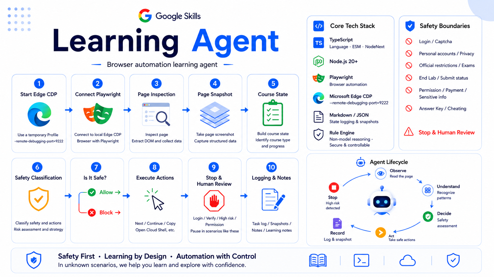

# Google Skills Learning Agent

Language: English | [简体中文](README.zh-CN.md)

Guarded MVP automation scaffold for reading Google Skills course/lab pages, extracting current state, validating safe next actions, and maintaining learning notes.

## Prerequisites

Install Node.js 20 or newer so `node` and `npm` are available on `PATH`.

```powershell
node --version
npm --version
```

Then install local dependencies:

```powershell
cd google-skills-learning-agent
npm install
```

## First Run

Start Microsoft Edge with a temporary automation profile:

```powershell
npm run start-edge-cdp
```

Open the Google Skills course/lab manually in that Edge window. Handle login and credentials yourself.

Inspect the environment and visible state:

```powershell
npm run check-env
npm run inspect-tabs
npm run inspect-page
npm run extract-course-state
```

## Safety Model

This project reads visible content, classifies page/action risk, and logs learning progress. It does not answer official quizzes, submit assessments, bypass platform restrictions, use personal Google Cloud credentials, or proceed through ambiguous billing/account/project states.

## Project Origin

This project was built from an initial autonomous learning-agent prompt and a phased MVP implementation plan.

- [Project Prompt](docs/PROJECT_PROMPT.md)
- [MVP Implementation Plan](docs/MVP_IMPLEMENTATION_PLAN.md)

## Reusable Lab Knowledge

Before running another Google Skills lab, review `LAB_EXECUTION_KNOWLEDGE.md`. Add a new dated entry when a lab introduces a workflow or failure mode that is not already covered.
