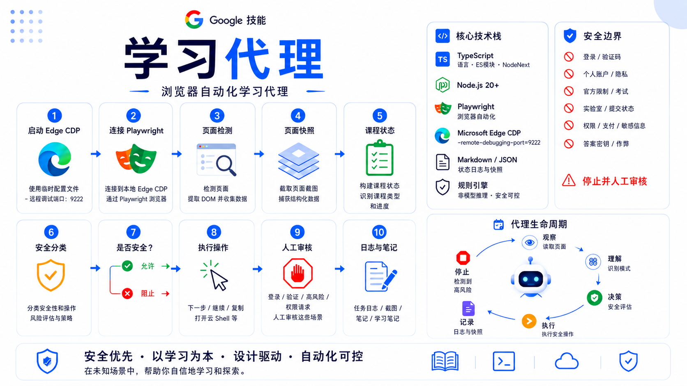

# Google Skills Learning Agent

语言：[English](README.md) | 简体中文

这是一个面向 Google Skills 课程和实验室的受保护学习自动化 MVP。它可以读取课程页面、提取当前学习状态、判断下一步操作是否安全，并持续维护学习笔记、命令记录、错误修复和可复用的实验经验。

## 项目定位

这个项目是学习代理，不是绕过平台规则的工具，也不是答题机器人。它的目标是在合规范围内尽可能自动化普通课程阅读、教程跟做、实验命令执行、进度验证和学习记录。

它不会自动回答官方 quiz、提交 assessment、绕过登录或评分机制、使用个人 Google Cloud 凭据，或在账号、计费、项目归属不明确时继续执行。

## 环境要求

请先安装 Node.js 20 或更高版本，并确保 `node` 和 `npm` 已经加入 `PATH`。

```powershell
node --version
npm --version
```

然后在项目目录安装本地依赖：

```powershell
cd google-skills-learning-agent
npm install
```

## 首次运行

使用临时自动化配置启动 Microsoft Edge：

```powershell
npm run start-edge-cdp
```

在这个 Edge 窗口中手动打开 Google Skills 课程或 lab。登录、账号选择、凭据输入等敏感步骤需要由你手动完成。

随后可以检查环境和当前页面状态：

```powershell
npm run check-env
npm run inspect-tabs
npm run inspect-page
npm run extract-course-state
```

## 安全模型

项目会读取可见页面内容、分类页面和操作风险，并记录学习进度。遇到以下情况会停止并等待人工处理：

- 登录、账号选择、重新认证或凭据输入
- 个人 Google 账号或个人 Cloud 项目不明确
- 计费、付款、免费试用、credits、价格或成本警告
- CAPTCHA、安全验证、身份验证或反自动化提示
- 官方 quiz、assessment、exam 或需要提交答案的页面
- End Lab、删除、确认删除、启用计费等高风险操作
- 任何可能绕过平台限制、伪造完成状态或调用隐藏接口的行为

## 可复用实验知识

在开始新的 Google Skills lab 前，优先查看 [LAB_EXECUTION_KNOWLEDGE.md](LAB_EXECUTION_KNOWLEDGE.md)。如果新 lab 出现了新的工作流、错误模式或排查经验，就添加一条新的经验记录，方便后续 lab 直接复用。

## 项目来源

这个项目来自一个自动化学习代理 prompt 和一个分阶段 MVP 实施计划。

- [Project Prompt](docs/PROJECT_PROMPT.md)
- [MVP Implementation Plan](docs/MVP_IMPLEMENTATION_PLAN.md)

## 主要文件

- [TASK_LOG.md](TASK_LOG.md)：重要操作记录
- [LEARNING_NOTES.md](LEARNING_NOTES.md)：学习笔记
- [CONCEPT_MAP.md](CONCEPT_MAP.md)：概念图谱
- [REVIEW_QUESTIONS.md](REVIEW_QUESTIONS.md)：原创复习问题
- [COMMANDS_USED.md](COMMANDS_USED.md)：命令执行记录
- [ERRORS_AND_FIXES.md](ERRORS_AND_FIXES.md)：错误和修复记录
- [COURSE_PROGRESS.md](COURSE_PROGRESS.md)：课程进度
- [LAB_EXECUTION_KNOWLEDGE.md](LAB_EXECUTION_KNOWLEDGE.md)：可复用 lab 执行经验

## 常用脚本

```powershell
npm run check-env
npm run start-edge-cdp
npm run inspect-tabs
npm run inspect-page
npm run extract-course-state
npm run snapshot-page
npm run run-safe-action
```

## 自动化边界

当 lab 账号和 lab 项目已经确认时，代理可以执行教程中明确展示或直接要求的 Cloud Shell 命令，并记录命令目的、预期结果、实际结果和涉及资源。

如果状态不明确，尤其是可能影响个人账号、计费、身份验证、官方测评或平台规则时，代理必须停止。
